# NoxPanel 8-Gate Audit System
*Progressive Zero-Fault Expansion Protocol for Enterprise-Ready AI Suite*

## Overview

The NoxPanel project employs a **comprehensive 8-gate audit system** with **progressive unlocking every 2 gates** that ensures each expansion phase meets enterprise-grade standards before unlocking advanced capabilities. This prevents technical debt, security vulnerabilities, and architectural inconsistencies.

### 🔒 **LOCKED FEATURES UNTIL ALL 8 GATES PASS**
- Voice processing services & LLM integration
- Real-time streaming API frameworks  
- Enterprise monitoring & analytics
- Advanced multi-container orchestration
- Text-to-speech containers
- Advanced plugin marketplace
- Enterprise security modules

### 🎯 **PROGRESSIVE UNLOCK SCHEDULE**
- **Gates 1-2 Complete** → Unlock: Database systems, Authentication, Basic APIs
- **Gates 3-4 Complete** → Unlock: Plugin system, Advanced APIs, Security middleware  
- **Gates 5-6 Complete** → Unlock: Multi-container orchestration, Load balancing
- **Gates 7-8 Complete** → Unlock: ALL advanced features (Voice, Streaming, LLM)

---

## 8-Gate Audit Architecture

### Gate 1: Core Containerization ✅ *[CURRENT]*
**Focus:** Flask application containerization and foundation security

#### Test Categories (100 points total):
- **Docker Infrastructure** (30 points)
- **Application Structure** (35 points)  
- **Security & Quality** (35 points)

---

### Gate 2: Basic Security Validation 🔒 *[LOCKED]*
**Focus:** Authentication, authorization, and basic security hardening

#### Planned Test Categories:
- **Authentication Systems** (40 points)
- **Authorization & Permissions** (35 points)
- **Basic Security Headers** (25 points)

**🎉 Gates 1-2 Complete → UNLOCK**: Database systems, Authentication APIs, Basic endpoints

---

### Gate 3: Performance Benchmarks 🔒 *[LOCKED]*
**Focus:** Performance optimization and basic scalability

#### Planned Test Categories:
- **Response Time Benchmarks** (35 points)
- **Resource Utilization** (40 points)
- **Basic Load Testing** (25 points)

---

### Gate 4: API Security Hardening 🔒 *[LOCKED]*
**Focus:** API security, rate limiting, and input validation

#### Planned Test Categories:
- **API Security Testing** (40 points)
- **Rate Limiting Validation** (35 points)
- **Input Sanitization** (25 points)

**🎉 Gates 3-4 Complete → UNLOCK**: Plugin system, Advanced APIs, Security middleware

---

### Gate 5: Integration Testing 🔒 *[LOCKED]*
**Focus:** Component integration and workflow validation

#### Planned Test Categories:
- **Component Integration** (40 points)
- **Workflow Validation** (35 points)  
- **Error Handling** (25 points)

---

### Gate 6: Load Testing & Scalability 🔒 *[LOCKED]*
**Focus:** High-load scenarios and scaling validation

#### Planned Test Categories:
- **Concurrent Load Testing** (40 points)
- **Scalability Validation** (35 points)
- **Resource Management** (25 points)

**🎉 Gates 5-6 Complete → UNLOCK**: Multi-container orchestration, Load balancing, Caching

---

### Gate 7: Production Deployment 🔒 *[LOCKED]*
**Focus:** Production-ready deployment and configuration

#### Planned Test Categories:
- **Deployment Validation** (40 points)
- **Configuration Management** (35 points)
- **Monitoring & Alerting** (25 points)

---

### Gate 8: Enterprise Security Audit 🔒 *[LOCKED]*
**Focus:** Enterprise-grade security and compliance validation

#### Planned Test Categories:
- **Security Vulnerability Scanning** (40 points)
- **Compliance Validation** (35 points)
- **Enterprise Security Features** (25 points)

**🎉 Gates 7-8 Complete → UNLOCK**: Voice processing, Streaming APIs, LLM integration, Enterprise features

---

## Audit Execution Workflow

### Phase 1: Current State (Gate 1)

```mermaid
graph TD
    A[Gate 1 Audit] --> B{Score ≥ 100?}
    B -->|Yes| C[✅ Unlock Gate 2]
    B -->|80-99| D[⚠️ Conditional Pass]
    B -->|<80| E[❌ Fix & Retry]
    D --> F[Address Issues]
    F --> A
    E --> A
    C --> G[Begin Gate 2 Development]
```


### Phase 2-4: Sequential Unlocking
Each subsequent gate follows identical pattern:
1. Previous gate must achieve **100/100 score**
2. Development of next phase capabilities
3. Comprehensive audit execution
4. Pass/fail determination
5. Feature unlock or remediation

---

## Audit Results Framework

### Machine-Readable Output
All audits generate structured JSON results:

```json
{
  "audit_gate": 1,
  "timestamp": "2024-01-XX T00:00:00",
  "score": 100,
  "max_score": 100,
  "status": "PASS|CONDITIONAL_PASS|FAIL",
  "tests": [
    {
      "name": "Test Name",
      "success": true,
      "points": 10,
      "details": "Test details",
      "timestamp": "..."
    }
  ],
  "unlocked_modules": ["audit_gate_2"],
  "locked_modules": ["voice_processing", "streaming_apis", "..."],
  "recommendations": ["..."]
}
```

### Status Definitions
- **PASS**: 100/100 score, full gate unlock
- **CONDITIONAL_PASS**: 80-99 score, remediation required
- **FAIL**: <80 score, complete retry required

---

## Development Protocol

### 🚫 Forbidden During Audit Gates
1. **No multi-service containers** until Gate 4 passes
2. **No voice/AI features** until all gates pass
3. **No streaming capabilities** until all gates pass
4. **No advanced frontend frameworks** until Gate 3 passes
5. **No LLM integration** until all gates pass

### ✅ Permitted During Gate 1
1. Flask application refinement
2. Basic API endpoint development
3. Static asset optimization
4. Database schema design
5. Core business logic implementation

### 📋 Audit Checklist

#### Pre-Audit Requirements
- [ ] All previous gates passed with 100/100
- [ ] Test environment prepared
- [ ] Required tools installed
- [ ] Documentation updated
- [ ] Code reviewed and merged

#### Post-Audit Actions  
- [ ] Results documented and stored
- [ ] Issues addressed if score <100
- [ ] Next gate planning initiated
- [ ] Stakeholder notification completed
- [ ] Architecture documentation updated

---

## Tool Integration

### Continuous Integration
```yaml
# Suggested CI/CD integration
audit_gate_1:
  runs-on: ubuntu-latest
  steps:
    - name: Checkout code
    - name: Setup Python
    - name: Install dependencies
    - name: Run Audit Gate 1
      run: python scripts/audit_1.py
    - name: Validate 100/100 score
    - name: Archive audit results
```

### Local Development
```bash
# Quick audit check
python scripts/audit_1.py

# Full audit with detailed output
python scripts/audit_1.py --project-root . --output results.json

# Check previous results
cat docs/audit_results_1.json | jq '.score'
```

---

## Support and Troubleshooting

### Common Gate 1 Issues
1. **Docker build failures**: Check Dockerfile syntax and base image availability
2. **Missing dependencies**: Verify requirements.txt completeness
3. **Environment configuration**: Ensure .env.example includes all required variables
4. **Security violations**: Review non-root user and production settings

### Escalation Path
1. **Local debugging**: Use audit script verbose mode
2. **Documentation review**: Check this audit plan
3. **Code review**: Examine reference implementations
4. **Team consultation**: Engage architecture review team

---

## Metrics and Success Tracking

### Key Performance Indicators
- **Gate completion time**: Target <2 hours per gate
- **First-pass success rate**: Target >90%
- **Critical issue discovery**: Early detection preferred
- **Remediation cycle time**: Target <4 hours

### Quality Gates Summary
| Gate | Focus Area | Unlock Trigger | Estimated Duration |
|------|------------|-----------------|-------------------|
| 1 | Core Containerization | Individual | 2-4 hours |
| 2 | Basic Security | **Gates 1-2** → DB/Auth unlock | 3-6 hours |
| 3 | Performance | Individual | 4-8 hours |
| 4 | API Security | **Gates 3-4** → Plugin/API unlock | 4-8 hours |
| 5 | Integration Testing | Individual | 6-12 hours |
| 6 | Load & Scalability | **Gates 5-6** → Multi-container unlock | 8-16 hours |
| 7 | Production Deploy | Individual | 8-16 hours |
| 8 | Enterprise Security | **Gates 7-8** → ALL features unlock | 12-24 hours |

**Total Project Timeline**: 47-94 hours across all 8 gates

---

*This 8-gate audit plan enforces progressive zero-fault expansion methodology, ensuring each phase builds upon a validated foundation with strategic unlocks every 2 gates. The most advanced features remain locked until complete enterprise-grade validation.*
