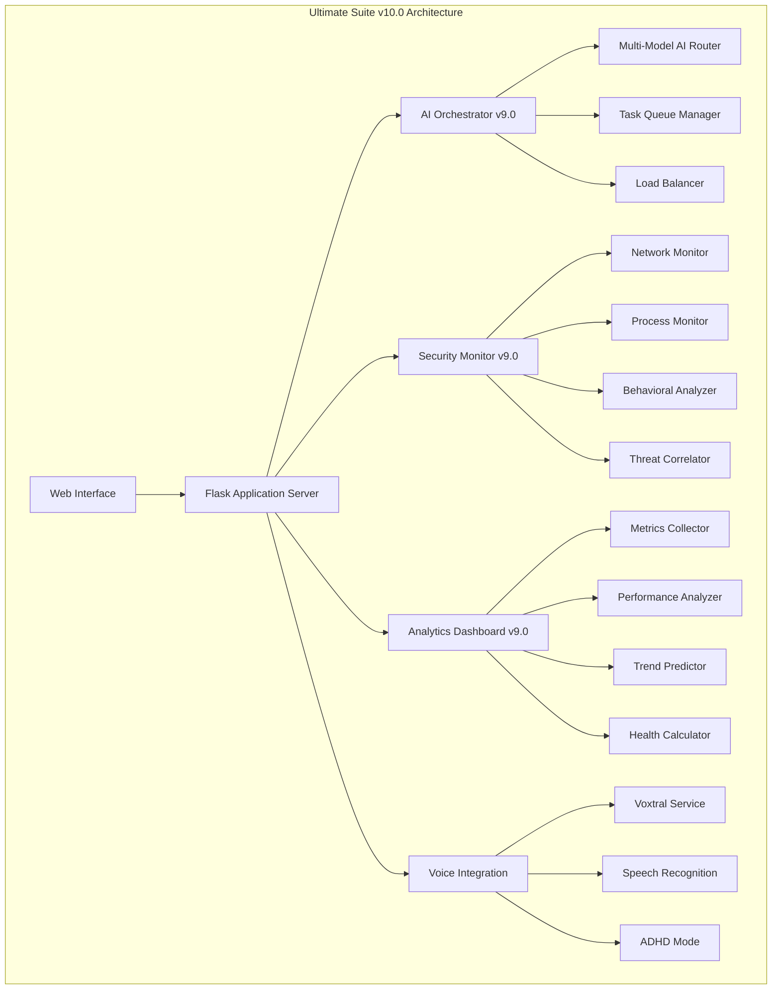
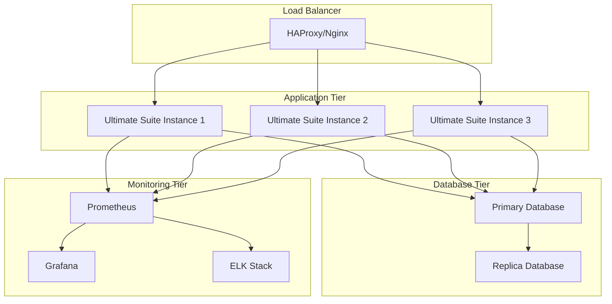

# 🚀 ULTIMATE SUITE v10.0 - COMPREHENSIVE DEPLOYMENT GUIDE
## Advanced AI Orchestration & Enterprise-Grade Security Platform

---

## 📋 TABLE OF CONTENTS

1. [System Architecture](#system-architecture)
2. [Advanced Features Overview](#advanced-features-overview)
3. [Installation & Setup](#installation--setup)
4. [Configuration Management](#configuration-management)
5. [API Documentation](#api-documentation)
6. [Security Implementation](#security-implementation)
7. [Performance Optimization](#performance-optimization)
8. [Monitoring & Analytics](#monitoring--analytics)
9. [Troubleshooting Guide](#troubleshooting-guide)
10. [Enterprise Deployment](#enterprise-deployment)

---

## 🏗️ SYSTEM ARCHITECTURE

### Core Components Architecture



### Technology Stack

| Component | Technology | Version | Purpose |
|-----------|------------|---------|---------|
| **Backend Framework** | Flask | 2.3+ | Web application server |
| **AI Orchestration** | Custom Python | 3.12+ | Multi-model AI coordination |
| **Security Engine** | Custom Python | 3.12+ | Real-time threat detection |
| **Analytics Engine** | Custom Python | 3.12+ | Performance monitoring |
| **Database** | SQLite | 3.40+ | Data persistence |
| **Voice Processing** | Voxtral/Whisper | Latest | Speech recognition |
| **Frontend** | HTML5/CSS3/JS | ES2020+ | User interface |
| **Monitoring** | psutil | 5.9+ | System metrics |
| **Networking** | socket/asyncio | Python std | Network operations |

---

## 🌟 ADVANCED FEATURES OVERVIEW

### 🧠 AI Orchestrator v9.0

**Intelligent Multi-Model Coordination**
- **Dynamic Model Selection**: Automatically routes tasks to optimal AI models
- **Performance-Based Routing**: Uses real-time metrics for model selection
- **Chain Processing**: Sequential model processing for complex tasks
- **Load Balancing**: Distributes workload across available models
- **Caching System**: Reduces redundant processing with intelligent caching

**Supported AI Models:**
- **GPT-4**: Conversational and reasoning tasks
- **Claude-3**: Analytical and research tasks
- **Gemini Pro**: Creative and multimodal tasks
- **Mistral Large**: Technical and coding tasks
- **Security AI**: Threat analysis and security tasks
- **Voxtral**: Voice processing and audio analysis

### 🔒 Security Monitor v9.0

**Real-Time Threat Detection**
- **Network Monitoring**: Continuous analysis of network connections
- **Process Surveillance**: Real-time process monitoring and analysis
- **Behavioral Analysis**: AI-driven anomaly detection
- **Threat Correlation**: Multi-source threat intelligence correlation
- **Automated Response**: Immediate action on critical threats

**Security Features:**
- **Port Scan Detection**: Identifies scanning attempts
- **Malware Detection**: Process-based malware identification
- **Intrusion Detection**: Network-based intrusion monitoring
- **DDoS Protection**: Rate limiting and attack mitigation
- **File Integrity**: Critical file change monitoring

### 📊 Analytics Dashboard v9.0

**Comprehensive System Monitoring**
- **Real-Time Metrics**: Live system performance monitoring
- **Predictive Analytics**: Trend analysis and forecasting
- **Health Scoring**: Overall system health calculation
- **Custom Dashboards**: Configurable monitoring widgets
- **Performance Optimization**: Automated recommendations

**Monitored Metrics:**
- **System Resources**: CPU, Memory, Disk, Network
- **Application Performance**: Response times, error rates
- **Security Events**: Threat levels, incident counts
- **User Activity**: Session data, usage patterns
- **Network Activity**: Bandwidth, connections, traffic

### 🎤 Voice Integration

**Advanced Speech Processing**
- **Voxtral Integration**: Superior speech-to-text accuracy
- **ADHD-Friendly Mode**: Accessibility-optimized interactions
- **Multi-Language Support**: Various language processing
- **Real-Time Transcription**: Live audio processing
- **Voice Commands**: Natural language interface

---

## 🛠️ INSTALLATION & SETUP

### Prerequisites

```bash
# Python 3.12 or higher
python --version

# Required Python packages
pip install flask flask-cors psutil matplotlib requests asyncio
```

### Core Installation

```bash
# Clone or download the Ultimate Suite
cd "K:\Project Heimnetz"

# Install core dependencies
pip install -r requirements.txt

# Start the Ultimate Suite v10.0
python ultimate_webapp_v10.py
```

### Voice Integration Setup (Optional)

```bash
# Install voice processing dependencies
pip install SpeechRecognition pyttsx3 pyaudio librosa websockets

# Install Voxtral dependencies
pip install torch transformers accelerate
```

### Docker Deployment

```dockerfile
# Use provided Dockerfile
docker build -t ultimate-suite-v10 .
docker run -p 5000:5000 ultimate-suite-v10
```

---

## ⚙️ CONFIGURATION MANAGEMENT

### Environment Variables

```bash
# Core Configuration
ULTIMATE_SUITE_PORT=5000
ULTIMATE_SUITE_HOST=127.0.0.1
ULTIMATE_SUITE_DEBUG=false

# Database Configuration
DATABASE_PATH=ultimate_suite.db
ANALYTICS_DB_PATH=analytics.db
SECURITY_DB_PATH=security_monitor.db

# AI Configuration
AI_ORCHESTRATOR_ENABLED=true
MAX_CONCURRENT_TASKS=10
TASK_TIMEOUT=300

# Security Configuration
SECURITY_MONITOR_ENABLED=true
THREAT_DETECTION_LEVEL=medium
AUTO_RESPONSE_ENABLED=true

# Analytics Configuration
ANALYTICS_ENABLED=true
METRICS_RETENTION_DAYS=30
PERFORMANCE_SAMPLING_RATE=60
```

### Configuration Files

**ultimate_config.json**
```json
{
  "system": {
    "name": "Ultimate Suite v10.0",
    "version": "10.0.0",
    "environment": "production"
  },
  "ai_orchestrator": {
    "enabled": true,
    "models": {
      "gpt-4": {
        "enabled": true,
        "priority": 1,
        "max_tokens": 8192
      },
      "claude-3": {
        "enabled": true,
        "priority": 2,
        "max_tokens": 100000
      }
    }
  },
  "security": {
    "monitoring_enabled": true,
    "threat_levels": {
      "port_scan_threshold": 10,
      "ddos_threshold": 100,
      "anomaly_threshold": 2.0
    }
  },
  "analytics": {
    "enabled": true,
    "real_time_updates": true,
    "chart_generation": true,
    "health_scoring": true
  }
}
```

---

## 📡 API DOCUMENTATION

### Core System APIs

#### System Information
```http
GET /api/system/info
Content-Type: application/json

Response:
{
  "hostname": "system-name",
  "platform": "Windows-10",
  "cpu_cores": 8,
  "memory_total": 16000000000,
  "uptime": 3600.0
}
```

#### Performance Metrics
```http
GET /api/system/performance
Content-Type: application/json

Response:
{
  "cpu_percent": 25.5,
  "memory_percent": 45.2,
  "disk_percent": 67.8,
  "network_io": {
    "bytes_sent": 1000000,
    "bytes_recv": 2000000
  },
  "timestamp": 1721246400.0
}
```

### AI Orchestrator APIs

#### Submit AI Task
```http
POST /api/ai/analyze
Content-Type: application/json

Request:
{
  "content": "Analyze this network traffic pattern",
  "type": "security",
  "priority": "high"
}

Response:
{
  "analysis": "Network traffic analysis results...",
  "model_used": "security-ai",
  "confidence": 0.92,
  "processing_time": 2.5,
  "task_id": "task_12345"
}
```

#### AI Orchestrator Status
```http
GET /api/ai/orchestrator/status
Content-Type: application/json

Response:
{
  "orchestrator_status": "running",
  "active_tasks": 3,
  "completed_tasks": 157,
  "queue_size": 2,
  "available_models": ["gpt-4", "claude-3", "security-ai"]
}
```

### Security Monitor APIs

#### Security Status
```http
GET /api/security/status
Content-Type: application/json

Response:
{
  "monitoring_status": "active",
  "active_threats": 0,
  "threat_levels": {
    "CRITICAL": 0,
    "HIGH": 0,
    "MEDIUM": 2,
    "LOW": 5
  },
  "blacklisted_ips": 15,
  "whitelisted_ips": 25
}
```

#### Recent Threats
```http
GET /api/security/threats
Content-Type: application/json

Response:
{
  "threats": [
    {
      "id": "threat_12345",
      "type": "port_scan",
      "level": "HIGH",
      "source_ip": "192.168.1.100",
      "description": "Port scan detected",
      "timestamp": 1721246400.0,
      "resolved": false
    }
  ]
}
```

### Analytics APIs

#### Dashboard Data
```http
GET /api/analytics/dashboard
Content-Type: application/json

Response:
{
  "current_status": {
    "cpu_percent": 25.5,
    "memory_percent": 45.2,
    "active_connections": 150
  },
  "alerts": [],
  "history": {
    "timestamps": [1721246400, 1721246460],
    "cpu": [25.5, 26.1],
    "memory": [45.2, 45.8]
  },
  "monitoring_status": "active"
}
```

#### System Health Score
```http
GET /api/analytics/health
Content-Type: application/json

Response:
{
  "health_score": 87.5
}
```

---

## 🔐 SECURITY IMPLEMENTATION

### Threat Detection Algorithms

**Port Scan Detection**
```python
def detect_port_scan(ip: str, port: int):
    """
    Advanced port scan detection using temporal analysis
    and connection pattern recognition.
    """
    time_window = 300  # 5 minutes
    threshold = 10     # connections

    # Track connection attempts per IP
    connection_count = count_connections(ip, time_window)

    if connection_count > threshold:
        create_threat(
            type=ThreatType.PORT_SCAN,
            level=ThreatLevel.HIGH,
            source_ip=ip,
            evidence={'connection_count': connection_count}
        )
```

**Behavioral Anomaly Detection**
```python
def analyze_behavioral_anomaly(metric: str, current_value: float):
    """
    Statistical anomaly detection using z-score analysis
    and machine learning baseline establishment.
    """
    baseline = get_baseline_metrics(metric)
    z_score = calculate_z_score(current_value, baseline)

    if abs(z_score) > ANOMALY_THRESHOLD:
        create_threat(
            type=ThreatType.ANOMALOUS_BEHAVIOR,
            level=determine_threat_level(z_score),
            evidence={'z_score': z_score, 'baseline': baseline}
        )
```

### Security Best Practices

1. **Network Segmentation**: Isolate critical systems
2. **Access Control**: Implement role-based permissions
3. **Encryption**: Use TLS/SSL for all communications
4. **Logging**: Comprehensive audit trail maintenance
5. **Monitoring**: 24/7 continuous monitoring
6. **Response**: Automated incident response procedures

---

## ⚡ PERFORMANCE OPTIMIZATION

### System Optimization

**Memory Management**
```python
# Efficient data structures
from collections import deque
metrics_buffer = deque(maxlen=10000)  # Circular buffer

# Memory monitoring
memory_usage = psutil.virtual_memory().percent
if memory_usage > 90:
    trigger_cleanup()
```

**CPU Optimization**
```python
# Multi-threading for concurrent operations
from concurrent.futures import ThreadPoolExecutor
executor = ThreadPoolExecutor(max_workers=8)

# Async processing for I/O operations
import asyncio
async def process_network_data():
    # Non-blocking network operations
    pass
```

**Database Optimization**
```sql
-- Indexed queries for performance
CREATE INDEX idx_metrics_timestamp ON metrics(timestamp);
CREATE INDEX idx_threats_level ON security_threats(level);

-- Efficient data retrieval
SELECT * FROM metrics
WHERE timestamp > ?
ORDER BY timestamp DESC
LIMIT 1000;
```

### Caching Strategy

**Redis Implementation** (Optional)
```python
import redis
cache = redis.Redis(host='localhost', port=6379, db=0)

def cached_ai_response(query_hash: str, ttl: int = 3600):
    """Cache AI responses for repeated queries"""
    cached = cache.get(query_hash)
    if cached:
        return json.loads(cached)
    return None
```

---

## 📊 MONITORING & ANALYTICS

### Key Performance Indicators (KPIs)

| Metric | Target | Critical Threshold |
|--------|--------|-------------------|
| **CPU Usage** | < 70% | > 90% |
| **Memory Usage** | < 80% | > 95% |
| **Response Time** | < 200ms | > 1000ms |
| **Error Rate** | < 1% | > 5% |
| **Availability** | > 99.9% | < 99% |
| **Security Score** | > 90% | < 70% |

### Custom Dashboards

**Executive Dashboard**
- System health overview
- Security posture summary
- Performance trends
- Resource utilization

**Technical Dashboard**
- Detailed metrics
- Log analysis
- Threat intelligence
- Performance profiling

**Operations Dashboard**
- Real-time monitoring
- Alert management
- Incident response
- Maintenance status

---

## 🔧 TROUBLESHOOTING GUIDE

### Common Issues

**Issue: High CPU Usage**
```bash
# Diagnosis
python -c "import psutil; print(psutil.cpu_percent(interval=5))"

# Solution
# Check for infinite loops in monitoring threads
# Reduce monitoring frequency
# Optimize database queries
```

**Issue: Memory Leaks**
```bash
# Diagnosis
python -c "import psutil; print(psutil.virtual_memory())"

# Solution
# Clear metrics buffers periodically
# Implement garbage collection
# Monitor object references
```

**Issue: Security False Positives**
```bash
# Diagnosis
tail -f security_monitor.log | grep "THREAT DETECTED"

# Solution
# Adjust detection thresholds
# Whitelist legitimate IPs
# Fine-tune behavioral analysis
```

### Debugging Tools

**Log Analysis**
```bash
# View system logs
tail -f ultimate_suite_v10.log

# Filter by component
grep "AI Orchestrator" ultimate_suite_v10.log

# Search for errors
grep "ERROR" ultimate_suite_v10.log
```

**Performance Profiling**
```python
import cProfile
cProfile.run('main_function()', 'profile_output.prof')
```

---

## 🏢 ENTERPRISE DEPLOYMENT

### Production Architecture



### Scaling Considerations

**Horizontal Scaling**
- Multiple instance deployment
- Load balancer configuration
- Session management
- Database sharding

**Vertical Scaling**
- CPU optimization
- Memory allocation
- Storage optimization
- Network bandwidth

### High Availability

**Redundancy**
- Multi-instance deployment
- Database replication
- Failover mechanisms
- Health checks

**Disaster Recovery**
- Regular backups
- Recovery procedures
- Data synchronization
- Business continuity

---

## 📈 FUTURE ROADMAP

### Planned Enhancements

**v11.0 Features**
- Kubernetes deployment support
- Advanced ML models integration
- Real-time collaboration features
- Enhanced mobile interface

**v12.0 Features**
- Blockchain integration
- Quantum-safe encryption
- AR/VR interface support
- Advanced AI reasoning

---

## 📞 SUPPORT & MAINTENANCE

### Support Channels
- **Documentation**: Comprehensive guides and tutorials
- **Community**: Open-source community support
- **Enterprise**: Dedicated enterprise support

### Maintenance Schedule
- **Daily**: Automated health checks
- **Weekly**: Performance optimization
- **Monthly**: Security updates
- **Quarterly**: Feature releases

---

## 📄 LICENSE & COMPLIANCE

### License Information
- **Open Source**: MIT License for core components
- **Enterprise**: Commercial license available
- **Third-Party**: Individual component licenses

### Compliance Standards
- **Security**: ISO 27001, SOC 2
- **Privacy**: GDPR, CCPA compliant
- **Industry**: Sector-specific compliance

---

*Ultimate Suite v10.0 - Advanced AI Orchestration*
*Generated on: July 17, 2025*
*Version: 10.0.0*
